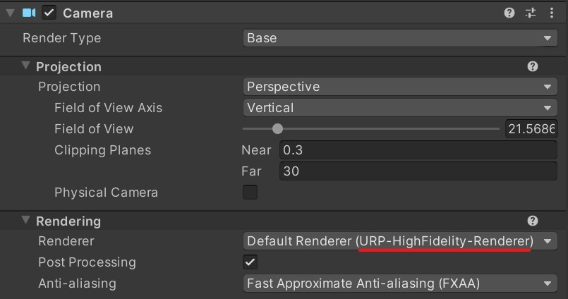
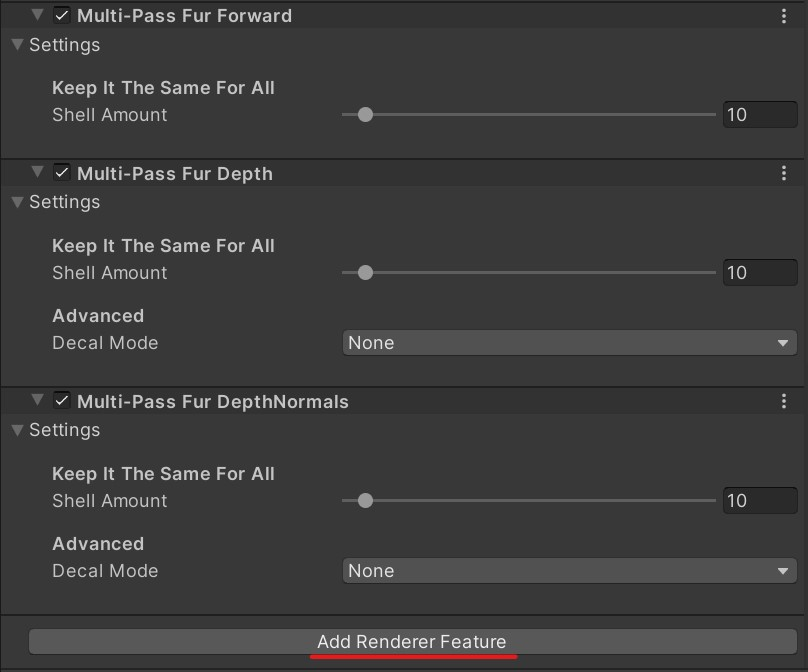

Multi-Pass Fur
==============

Multi-Pass Fur does not use geometry shader, so it can run on GPUs without Geometry Shader support. (Metal API, Apple Silicon, ...)

Although most Android devices support geometry shader, Multi-Pass Fur usually runs **much faster** than Geometry Shader Fur on these platforms.

How To Use
----------

1. Find and select the active URP renderer in the scene's camera inspector window.

   

2. Add the following Multi-Pass Fur Renderer Features to your active URP renderer asset.

- Multi-Pass Fur Forward

- Multi-Pass Fur Depth

- Multi-Pass Fur DepthNormals

   

3. Select the material, choose the shader named "Universal Render Pipeline / Fur / Multi-Pass Shell / Lit".

4. Adjusting material properties just like the geometry-shader-based fur.
   
   Note: You should now set "Shell Amount" in Fur Renderer Features. **Remember to keep it the same in all Fur Renderer Features.**
   
Known Issues
------------

1. ~~Currently Multi-Pass Fur does not provide correct information to URP Decals.~~ (Fixed)
2. Currently Multi-Pass Fur does not render to GBuffer, it will act like forward object in Deferred path. (In progress)
3. Currently Multi-Pass Fur does not render fur shadow, so mesh shadow only. (In progress)
4. Does not provide clear information to Profiler/Frame Debugger.
5. ... (Undiscovered)

